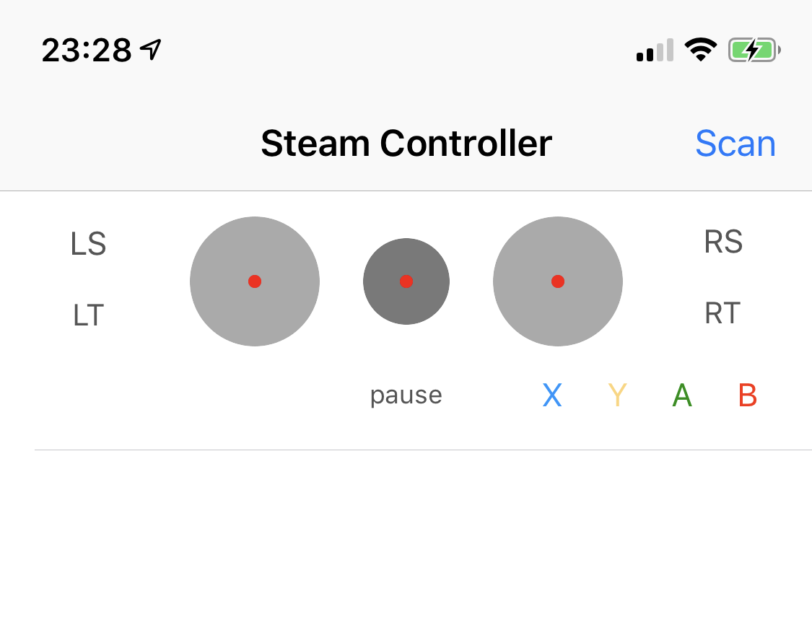

# SteamController

Drop-in support for Steam Controllers for iOS and tvOS.

For information about how to use a Steam Controller in Bluetoth LE mode, see [Steam Controller BLE](https://support.steampowered.com/kb_article.php?ref=7728-QESJ-4420#switch).

## Example

To run the example project, clone the repo, and run the SteamControllerTestApp target.



In the example app, power on your controller (in BLE or BLE pairing mode) and press Scan. Connected controllers will appear in the list, and the UI will reflect the state of the controller. Tapping on a controller from the list will play the  "identify" melody on that controller.

## Requirements

- iOS 12 (might work on earlier versions, haven't tested).
- Steam Controller with [BLE firmware](https://support.steampowered.com/kb_article.php?ref=7728-QESJ-4420#switch)..
- A game supporting MFi controllers using the `GameController` framework.

## Installation

### CocoaPods

[CocoaPods](http://cocoapods.org) is a dependency manager for Cocoa projects. You can install it with the following command:

```bash
$ gem install cocoapods
```
To integrate SteamController into your Xcode project using CocoaPods, specify it in your `Podfile`:

```ruby
pod 'SteamController'
```

Then, run the following command:

```bash
$ pod install
```

### Carthage

[Carthage](https://github.com/Carthage/Carthage) is a decentralized dependency manager that builds your dependencies and provides you with binary frameworks.

You can install Carthage with [Homebrew](http://brew.sh/) using the following command:

```bash
$ brew update
$ brew install carthage
```

To integrate SteamController into your Xcode project using Carthage, specify it in your `Cartfile`:

```ogdl
github "zydeco/SteamController"
```

Run `carthage update` to build the framework and drag the built `SteamController.framework` into your Xcode project.

## Usage

Everything should work like with MFi controllers. Depending on how your game works, you might not need any changes at all.

-  `#import <SteamController/SteamController.h>`.
-  To scan for Steam Controllers, call `[[SteamControllerManager sharedManager] scanForControllers]`.
-  The framework will post `GCControllerDidConnectNotification` and `GCControllerDidDisconnectNotification`, as with MFi controllers.
- Connected Steam Controllers will be returned in `[GCController controllers]`.
- Controllers are a subclass of `GCController` that implements the `extendedGamepad` profile.
- Core buttons are mapped to Apple's MFi Extended Gamepad Profile.
- Trackpads and stick can be mapped to D-pad and thumbsticks. (see below)
- Trackapds can be set to require click for input (default), or not.

#### Button Mapping
- Analog Stick: L-Thumbstick *(Default)*
- Left Trackpad *(Default)*: D-Pad *(Requires Click)*
- Right Trackpad *(Default)*: R-Thumbstick / C-Buttons *(Requires Click)*
- A, B, X, Y: Equivalent
- Bumpers/Shoulders: L1 / R1
- Triggers: L2 / R2
- Grip buttons: L3 / R3
- Steam Button: Menu (Pause) Button
- Analog Stick click: L3 *(Default)*
- Trackpad clicks: L3 / R3 (when click is not required for input)

##### Temporary button mappings
These combinations are temporary, and will be removed in a future version, once there is an API in
place to support the extra buttons. They are provided for compatibility with Provenance 1.5:

- Back: MFi+ Combo for Select *(supported in Provenance 1.5: PSX, N64)*
- Forward: MFi+ Combo for Start *(supported in Provenance 1.5: PSX, N64)*

##### Trackpad & Stick Mode Toggles
These combinations are temporary, and will be removed in a future version, once there is an API in
place to support combinations of steam+button:

- L-Pad Toggle: ◉ L-Pad Click + ◀︎ Back: toggles requiring click for input
- R-Pad Toggle: ◉ R-Pad Click + ▶︎ Forward: toggles requiring click for input
- Stick Toggle: ◉ Stick Click + ◀︎ Back: toggles between d-pad and left thumbstick mapping
<br><sup> Combo order is specific if you want to avoid misfiring buttons.</sup><br>

## License

SteamController is available under the MIT license. See the LICENSE file for more info.
